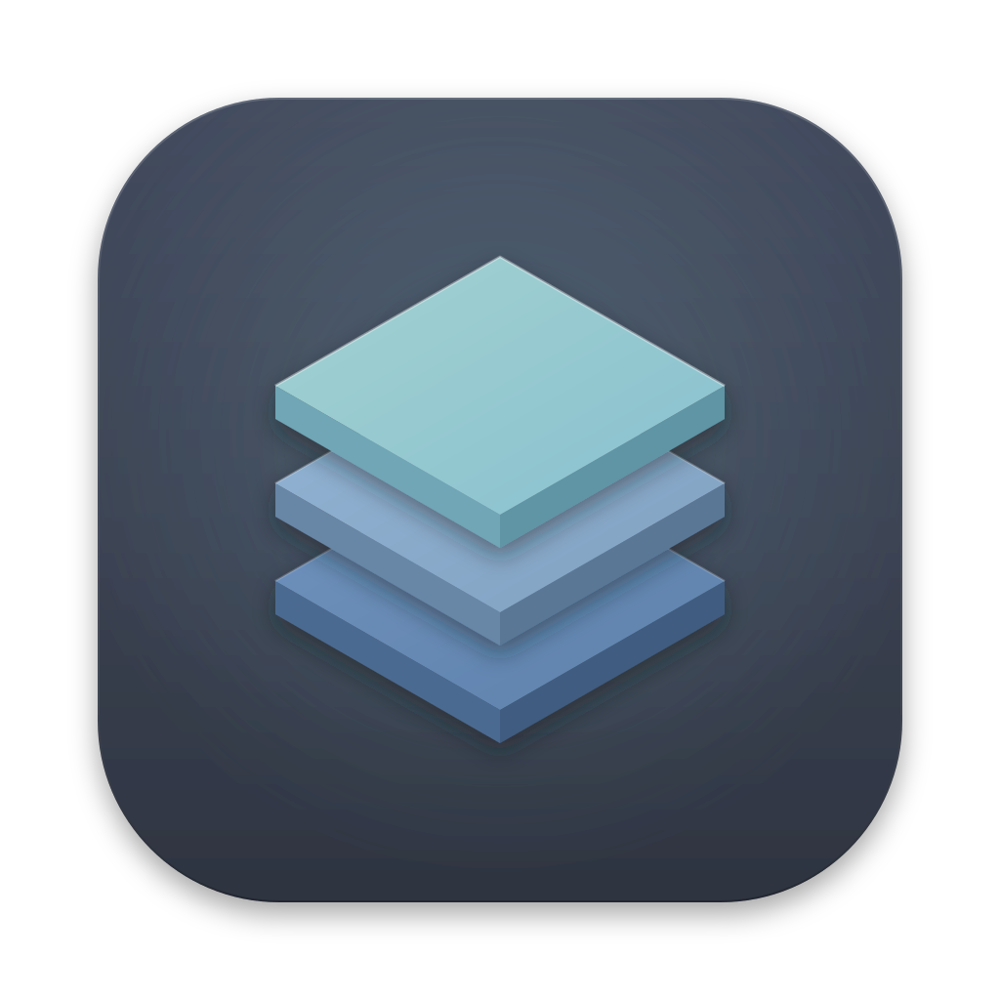
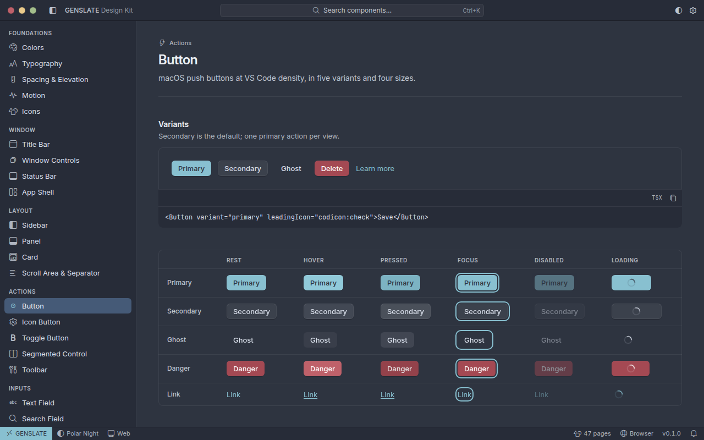
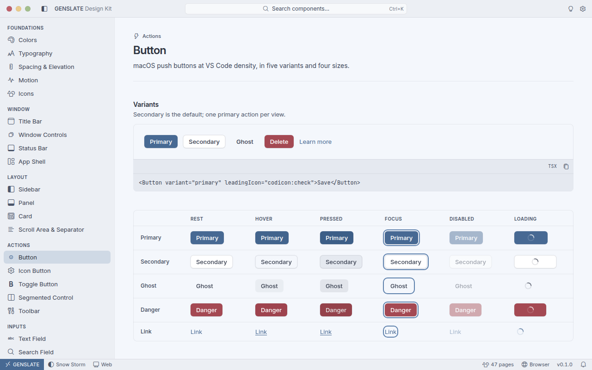

<div align="center">



# GENSLATE

**A family of fast, lightweight, and strictly portable desktop apps sharing one unified Nord design system.**

[](https://v2.tauri.app/)
[](https://www.rust-lang.org/)
[](https://react.dev/)
[](https://www.typescriptlang.org/)
[](https://tailwindcss.com/)
[](https://base-ui.com/)
[](https://bun.sh/)
[](https://moonrepo.dev/)
[](https://www.nordtheme.com/)

[Getting Started](other/documents/getting-started.md) ·
[Commands](other/documents/commands.md) ·
[Portability](other/documents/portability.md) ·
[Architecture](other/documents/architecture.md) ·
[Design System](other/documents/design-system.md) ·
[Contributing](other/documents/contributing.md)

</div>

---

<p align="center">
  
  <br />
  <sub><b>Example · Design Kit</b> — custom titlebar, Nord palette showcase, and real-time status bar in <i>Polar Night</i>.</sub>
</p>

## Highlights

- **100% Portable by Design** — Zero host pollution. All configurations, databases, logs, webview profiles, and caches live strictly inside the portable suite tree (`other/` and `storage/`).
- **Native Core & Minimal Footprint** — Built with Tauri 2 and Rust 2024 edition. Lightweight binaries, instant boot times, and tiny installers across macOS, Windows, and Linux.
- **Unified Nord Design Language** — Official Arctic Ice Studio Nord palettes (**Polar Night** dark, **Snow Storm** light), crafted to pixel-perfection with **VS Code density** and **macOS refinement**.
- **First-Class Custom Window Chrome** — Custom titlebars, integrated menu bars, and status bars everywhere. Native traffic lights on macOS; pixel-matched custom traffic lights on Windows and Linux with zero white-flash on launch.
- **End-to-End Type Safety** — TypeScript 7 in strict mode, typed IPC via `@genslate/tauri-bridge`, and strict Rust compiler checks (`forbid(unsafe_code)`).
- **Tokens as Single Source of Truth** — Unified token definitions compile automatically into CSS variables, Tailwind themes, TypeScript types, Rust constants, JSON schemas, and WCAG contrast audit reports.
- **Monorepo Velocity** — Monorepo orchestration by **moon** with hash-based caching and affected-only task execution; lightning-fast package management, tests, and scripts powered by **bun**.

---

## Portability & Isolated Architecture

GENSLATE applications are built from the ground up to be **fully self-contained and portable**. Whether running from a flash drive, an external SSD, or a custom directory, GENSLATE apps never write into OS user folders (such as `%LOCALAPPDATA%`, `%APPDATA%`, or `~/.config`) unless explicitly operating in read-only fallback mode.

All paths are resolved through the unified [`genslate-paths`](crates/paths) Rust crate.

### Directory Layout

Every runtime mode adheres to the exact same canonical layout:

```text
<root>/
├── programs/                         Launcher & suite binaries
│   ├── genslate/<app>/               GENSLATE native applications (e.g. programs/genslate/launcher/)
│   ├── portableapps.com/             PortableApps.com-format applications
│   └── portapps.io/                  Portapps.io applications
├── other/                            System and application operational state
│   ├── config/genslate/<app>/        Hand-editable TOML settings (config.toml & keybindings.toml, hot-reloaded)
│   ├── config/appdata/metadata/      Per-app launcher metadata (<app>.toml) and tab configs
│   ├── databases/genslate/<app>/     Durable application state (window state, recents, persistent stores)
│   ├── cache/genslate/<app>/         Disposable runtime state (webview profile, shader caches, bytecode)
│   ├── logs/app-logs/<app>/          Structured application runtime logs
│   └── documents/ licenses/ …        Shared documentation, legal notices, and resources
└── storage/users/shared/             User documents & media: Desktop, Documents, Downloads, Music, Pictures, Videos
```

### Layout Resolution Modes

| Mode | Trigger Condition | Root (`<root>`) |
|---|---|---|
| **Suite** | Exe is in `<installDir>/programs/genslate/<app>/` and `<installDir>/other/config/` exists | `installDir` — The portable suite directory |
| **Dev** | Debug build running inside a GENSLATE repository checkout | The repository root (workspace checkout) |
| **Standalone** | Standalone app extracted from its own portable zip | The folder containing the app executable |
| **Fallback** | Media is read-only or macOS app is run translocated (quarantined) | `<OS data dir>/GENSLATE` |

---

## The `other/cache/` Directory & Webview Isolation

### Why `other/cache/` Exists

In typical Tauri / Chromium desktop applications on Windows, Microsoft Edge WebView2 defaults to writing user profile data into `%LOCALAPPDATA%\<app-identifier>`. This pollutes the host machine and violates true portability.

In GENSLATE, every desktop application creates its main window **in code** with the window declared with `"create": false` in `tauri.conf.json`:

```rust
// Point the webview profile directly to the portable cache folder
WebviewWindowBuilder::from_config(app, config)?
    .data_directory(paths.cache_dir.join("webview"))
    .build()?;
```

This guarantees that all webview runtime files are confined exclusively to `<root>/other/cache/genslate/<app>/webview`.

### What Lives in `other/cache/`?

```text
other/cache/genslate/<app>/
└── webview/
    └── EBWebView/
        ├── GPUPersistentCache/       GPU & rendering shader caches
        ├── ShaderCache/              Compiled graphics driver pipeline caches
        ├── Default/Code Cache/       V8 JavaScript and WebAssembly compiled bytecode
        ├── Default/Cache/            HTTP network response and web asset cache
        ├── Default/Local Storage/    Webview LevelDB key-value stores
        ├── Default/Session Storage/  Volatile tab/session storage
        └── Crash reporting /         Local crash telemetry and error dumps
```

### Disposable vs. Durable State

| State Category | Folder | Nature | Safe to Delete? |
|---|---|---|:---:|
| **User Settings** | `other/config/genslate/<app>/` | Hand-editable TOML files (`config.toml`, `keybindings.toml`) | No (contains user settings) |
| **Durable State** | `other/databases/genslate/<app>/` | Application databases, window geometry, recents | No (preserves app state) |
| **User Files** | `storage/users/shared/` | User documents, downloads, desktop files | No (user workspace) |
| **Runtime Logs** | `other/logs/app-logs/<app>/` | Timestamped rotating trace logs | Safe (resets logs) |
| **Runtime Cache** | `other/cache/genslate/<app>/` | Webview profile, V8 bytecode, GPU & shader caches | **100% Safe to delete anytime** |

> [!TIP]
> You can wipe `<root>/other/cache/` at any time without losing any user configurations, open workspace files, or durable databases. Caches will be automatically and cleanly regenerated on the next launch.

> [!NOTE]
> In version control, `other/cache/*` is explicitly ignored via `.gitignore`, preserving only a tracking `.gitkeep` so the repository remains clean and lightweight.

---

## Nord Design System Showcase

<div align="center">

| Polar Night (Dark Theme) | Snow Storm (Light Theme) |
|:---:|:---:|
|  |  |
| `data-theme="polar-night"` | `data-theme="snow-storm"` |

</div>

`@genslate/design-system` provides high-density, accessible UI components built on **Base UI 1.8** and styled with **Tailwind CSS v4** token utilities:

- **Strict Density:** 13px Inter typography, 28px control heights, 22px navigation tree rows, 16px Codicons.
- **Flawless Chrome:** Native macOS overlay titlebar with native traffic lights; pixel-exact custom titlebars on Windows and Linux matching OS conventions.
- **Accessibility:** Full keyboard navigation, ARIA standards compliant, and verified against WCAG 2.2 AA contrast standards.
- **Dynamic Theming:** Seamless switching between Polar Night, Snow Storm, or automatically syncing with the host operating system.

---

## Quick Start

### Prerequisites

Ensure you have [proto](https://moonrepo.dev/proto) and the [Tauri system dependencies](https://v2.tauri.app/start/prerequisites/) installed for your OS:

```sh
# 1. Clone the repository
git clone https://github.com/ATOMANGELETTI/GENSLATE.git
cd GENSLATE

# 2. Pin toolchains (moon, bun, and rust via .prototools)
proto install

# 3. Setup workspace dependencies, git hooks, and moon schemas
bun run setup

# 4. Launch the Example Showcase app in dev mode with HMR
bun run dev
```

---

## Developer Commands

Root commands are executed via **bun** (`bun run <command>`):

| Command | Action | Description |
|---|---|---|
| `bun run setup` | Toolchain | Install dependencies, configure git hooks, and generate moon schemas |
| `bun run dev` | Development | Start the reference desktop app (`example`) with hot module reloading |
| `bun run build` | Compilation | Build all packages, crates, and desktop targets in the monorepo |
| `bun run package` | Packaging | Stage and package standalone portable ZIP archives into `release/<app>/` |
| `bun run test` | Testing | Run full test suite across TypeScript (`bun test`) and Rust (`cargo test`) |
| `bun run check` | Quality Audit | Run Biome linter, cspell, knip dead code, Clippy, rustfmt & token drift checks |
| `bun run format` | Formatting | Format all code across the repo using Biome and rustfmt |
| `bun run tokens` | Design Tokens | Regenerate CSS variables, Tailwind theme, TypeScript, and Rust token constants |
| `bun run version` | Release | Synchronize and bump project versions across all manifests |
| `bun run new-app <name>` | Scaffolding | Generate a new portable Tauri 2 application with ready-to-run boilerplate |
| `bun run clean` | Maintenance | Clean all target folders, node_modules, build outputs, and local caches |

<details>
<summary><b>Granular Moon Tasks</b> (Click to expand)</summary>

Execute any task across specific monorepo targets using `bun x moon run <project>:<task>`:

```sh
bun x moon run desktop-launcher:dev     # Run the Launcher desktop app
bun x moon run design-system:test       # Run design system unit tests
bun x moon run paths:check              # Check the paths Rust crate
bun x moon project-graph                # Visualize the project dependency graph
```

</details>

---

## Monorepo Architecture

<details open>
<summary><b>Repository Directory Structure</b></summary>

```text
GENSLATE/
├── desktop/                     Tauri 2 native desktop applications
│   ├── launcher/                The suite application launcher & process orchestrator
│   ├── example/                 Design Kit showcase (the reference app)
│   └── aistudio/ browser/ coder/ command/ editor/ explorer/ gallery/ jukebox/ terminal/ theater/ toolbox/
│                                Suite apps: titlebar · home (name + version) · status bar, ready to build on
├── packages/                    Shared TypeScript libraries & UI foundation
│   ├── design-system/           React components (Base UI 1.8 + Tailwind v4 + tailwind-variants)
│   ├── tokens/                  Nord design token definitions & compiler
│   ├── tauri-bridge/            Typed IPC bridge, platform detection, and window control bindings
│   ├── config-typescript/       Shared TypeScript configuration presets
│   └── config-vite/             Shared Vite build configuration (React Compiler, Tailwind v4)
├── crates/                      Shared Rust crates
│   ├── app-common/              genslate-app-common: shared config sections + loader, AppInfo
│   ├── paths/                   genslate-paths: suite, dev, standalone, and fallback path resolution
│   ├── design-tokens/           Rust constants and token utilities generated from source tokens
│   ├── testing/                 Test fixtures, fake repository trees, and mock environments
│   └── core/                    App-specific business logic crates (core/<app>, one per app)
├── webapp/                      Web portals & API services
├── scripts/bun-commands/        Single-purpose executable scripts backing bun run <cmd>
├── other/                       Portable suite assets, documents, configurations, logs, and cache
│   ├── config/                  Hand-editable app configurations & launcher metadata
│   ├── documents/               Comprehensive architectural guides & developer specifications
│   ├── resources/               Branding, application icons, and high-resolution screenshots
│   └── cache/                   Disposable webview and application runtime caches
├── .config/                     Tooling configs: moon, Biome, cspell, knip, commitlint, cargo
└── .claude/                     Claude Code settings, hooks, agents, commands, skills, rules
```

</details>

---

## Technology Stack

| Domain | Technology | Details |
|---|---|---|
| **Monorepo Engine** | **Moon 2.5.5** | Task orchestration, dependency graph, smart caching, affected-only execution |
| **JavaScript Runtime** | **Bun 1.4.2** | Ultra-fast package management, script runner, and test runner |
| **Desktop Framework** | **Tauri 2.11** | High-performance multi-window desktop shell powered by native webviews |
| **Native Systems** | **Rust 1.98** | Rust 2024 edition, memory-safe backend, `forbid(unsafe_code)` |
| **User Interface** | **React 19.3** | Functional components powered by the **React Compiler** & **Vite 8.3** |
| **Component Primitives** | **Base UI 1.8** | Unstyled, fully accessible primitives with complete keyboard navigation |
| **Styling & Theme** | **Tailwind CSS 4.3** | High-performance CSS engine driven by custom Nord token utilities |
| **Type System** | **TypeScript 7.0** | Strict mode typing across all packages and IPC boundaries |
| **Icons & Typography** | **Codicons & Lucide** | Inter font (UI), JetBrains Mono (code), VS Code Codicons & Lucide icons |
| **Quality & Linting** | **Biome 2.5** | Sub-millisecond formatting, linting, alongside Clippy and rustfmt |

---

## Documentation Index

| Guide | Description |
|---|---|
| [Getting Started](other/documents/getting-started.md) | Step-by-step developer environment setup and first app run |
| [Portability Architecture](other/documents/portability.md) | Deep-dive into folder hierarchies, webview isolation, and modes |
| [Monorepo Architecture](other/documents/architecture.md) | High-level system structure, crate relationships, and IPC patterns |
| [Design System Specification](other/documents/design-system.md) | Component contracts, Nord token usage, and layout guidelines |
| [IPC Protocol](other/documents/ipc.md) | Type-safe communication bridge between React and Rust |
| [Testing Guide](other/documents/testing.md) | Unit, integration, and visual regression testing practices |
| [Packaging & Release](other/documents/release.md) | Portable packaging pipeline and distribution workflows |
| [Security Policy](other/documents/security.md) | Sandboxing, IPC validation, and dependency auditing |
| [Contributing Guidelines](other/documents/contributing.md) | Commit conventions, code standards, and PR workflows |

---

## License

Proprietary — © 2026 GENSLATE. All rights reserved. See [LICENSE](LICENSE).  
Third-party notices and licenses: [`other/licenses/`](other/licenses/).
